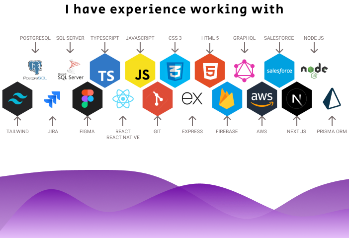

<table align="center" style="table-layout: auto; border-collapse: collapse;">
  <tr>
    <td align="center" width="100" style="vertical-align: middle; border: none;">
      
    </td>
    <td style="vertical-align: middle; text-align: center; border: none;">
      

        <strong style="font-size: 20px;">Ornella Grigolato - Full Stack Developer</strong>
        

          
          
        

      

    </td>
  </tr>
</table>
 
<table align="center" style="table-layout: auto; border-collapse: collapse;">
  <tr>
    <td align="center" width="600" style="vertical-align: middle; border: none;">
      

Motivated and highly skilled full stack developer with a passion for creating intuitive, visually appealing and functional websites. Looking to advance my career to leverage my broad curiosity in the tech world and grow as a professional. Proficient in English, +1 year of professional experience and strong desire to keep learning, I am eager to continue growing in this wonderful world that I am passionate about.

    </td>

</td>
  </tr>
</table>

 

